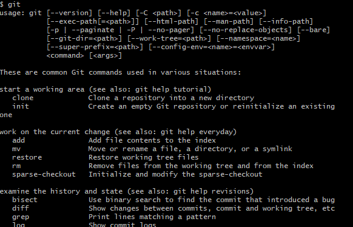

# 깃 시작하기


### 깃으로 할 수 있는 일은?

1. 버전관리
2. 백업하기 
3. 협업하기

#### 위 세가지의 기능은 순서대로 배워야 합니다.

why?

> 버전관리를 이해하지 못하면 백업을 이해할 수 없고, 백업을 이해하지 못하면 협업을 이해할 수 없습니다.
>
> 난이도 역시 갈수록 어려워지기 때문에 순서대로 배워야 합니다!!


## 깃 설치 확인

```bash
$ git
```

결과



와 같은 화면이 뜬다면 정상적으로 깃의 설치가 완료 되었음을 확인 할 수 있다.

위 명령어의 경우 각종 git에서 옵션이 표시된다.


## git 환경 설정하기

> 깃을 사용하기 전에 먼저 사용자 정보를 입력해야 합니다.
>
> why???
>
> 깃은 버전을 새로 만들 때 마다 버전을 만든 사용자의 정보도 함께 입력하기 때문입니다.


```bash
$ git config --global user.name "유저이름"
$ git config --global user.email "유저이메일"
```


아무런 오류가 나지 않았다면 정상적으로 설정이 완료된 것이다.


## 리눅스 명령 연습하기

> 터미널 창에서 깃을 사용하기 위해 쓰는 명령은 리눅스 명령과 같습니다.


참고 - 윈도우 탐색기의 '폴더'를 리눅스에서는 '디렉터리(directory)' 라고 부릅니다. 

### 현재 디렉터리 확인하기

#### 현재 위치의 경로 확인

```bash
$ pwd
```

#### 현 디렉터리 파일 확인

```bash
$ ls
```

#### 옵션 추가 ( -@)

```bash
$ ls -la
```

1. -l : 디렉터리의 상세정보를 표시하는 옵션
2. -a : 숨긴파일과 디렉터리를 표시하는 옵션
3. -r : 파일의 정렬 순서를 거꾸로 표시
4. -t : 파일의 작성 시간순으로 표시 (내림차순)

두가지 동시에 사용 가능  ex) ls -la or ls -al


### 터미널 창에서 디렉터리 이동하기

> 터미널 창에서 디렉터이 사이를 이동할 때는 'cd' 명령을 사용합니다.

#### 상위 디렉터리 이동

```bash
$ cd ..
```

#### 하위 디렉터리 이동

```bash
$ cd 이동하고자하는 디렉터리 이름
```

#### 처음 출발했던 디렉터리로 이동

```bash
$ cd ~
```


### 터미널 창에서 디렉터리 만들기 및 삭제하기

하위 디렉터리를 만들 때는 'mkdir' 명령어를 사용합니다.


#### 하위 디렉터리 만들기 

```bash
$ cd Document --> 도큐먼트라는 디렉터리로 이동
$ mkdir test
```

Document 라는 디렉터리로 이동 한 후 ,

mkdir 명령을 통해 test라는 하위 디렉터리를 생성하는 모습


#### 디렉터리 삭제

- rm 삭제명령 --> rm은 remove의 줄임말 입니다.
- -r 디렉터리 안에 있는 하위 디렉터리와 파일까지 함께 삭제됩니다.

```bash
$ rm -r test
$ ls
```


