# 03.깃과브랜치

고객사에게 다른 버전의 사용 설명서를 제공해야 할 때 발생하는 문제를 브랜치를 통해 해결할 수 있습니다.


## 03-1 브랜치란?

> 모든 버전 관리 시스템에는 '브랜치(branch)' 라는 개념이 있습니다. 브랜치는 원래 나뭇가지라는 뜻이지요.


### 브랜치 기능 살펴보기

깃으로 버전 관리를 시작하면 기본적으로 master 라는 브랜치가 만들어집니다.

사용자가 커밋할 때마다 master 브랜치는 최신 커밋을 가리킵니다.

즉, 브랜치는 커밋을 가리키는 포인터와 비슷하다고 생각하면 됩니다.


### 분기

여기서 분기점을 만들어 기존 master 브랜치를 유지하면서 기존 파일 내용을 수정하거나 새로운 기능을 구현할 파일을 만들 수 있습니다.


### 병합

새 브랜치에서 원하는 작업을 다 끝냈다면 새 브랜치에 있던 파일을 원래 master 브랜치에 합치는 행위


## 03-2 브랜치 만들기

---

### 실습상황 설정하기

1. 터미널 창을 열어 폴더에 새 디렉터리 생성 및 이동

```bash
$ mkdir manual
$ cd manual
```

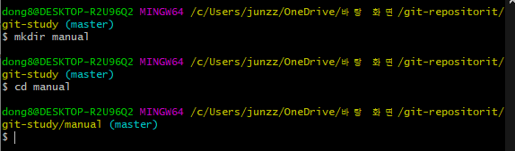

2. `ls -al` 명령어를 사용하여 .git 디렉터리가 만들어졌는지 확인.

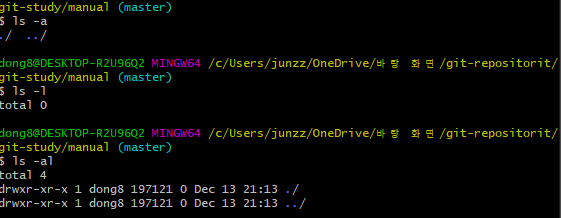

생성된 모습을 확인할 수 있다.


3. manual 디렉터리 안에 work.txt 파일 만들기


텍스트파일 자체 생성

명령어로 생성

```bash
$ vim work.txt
```

`i` 키 입력을 통해 입력 후 `esc` 를 통해 ex 입력창 들어가기

`:wq` 를 통해 저장 후 종료

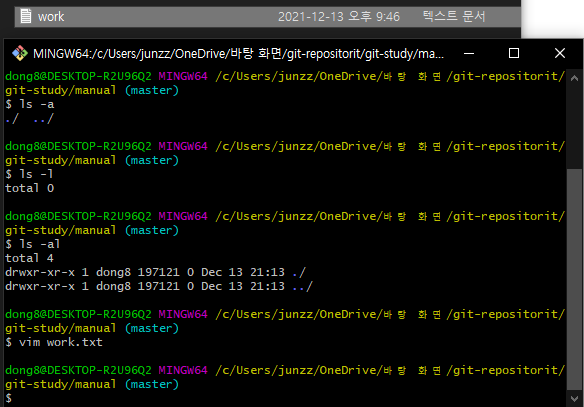

생성 된 모습을 확인할 수 있다.


4. 방금만든 work.txt 스테이지에 올리고 커밋합니다.

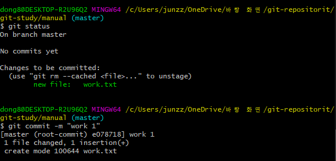

Change to be committed 라는 메세지를 통해 스테이징 된 상태 확인

그리고 commit 을 통해

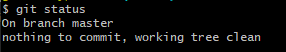

unmodified 상태임을 확인

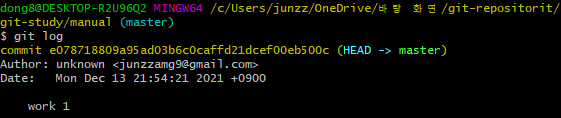

###### commit ~~~ : 커밋 해쉬

###### Author : 작성자

###### Date : 작성 날짜

###### work 1 : 커밋 명

이후 2회 더 커밋을 남긴다.(생략)

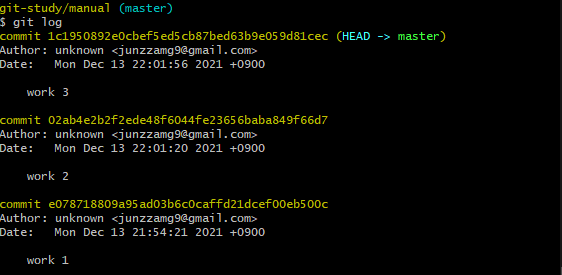

총 3회의 커밋을 완료하였다.

---


### 새 브랜치 만들기

> 이제부터 직접 브랜치를 만들면서 예시 상황을 해결 해 보자.
>
> 현재 상황 : apple, google, ms 라는 고개사가 있다고 가정해 보겠습니다.


#### 브랜치 확인명령

```bash
$ git branch
```

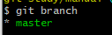

master 는 저장소를 만들 때 기본적으로 master 브랜치가 만들어 집니다. 그동안 일반적으로 branch 생성이 없었다면 master 브랜치에서 사용하게 되어 있습니다.


#### 브랜치 생성

```bash
$ git branch 생성할branch이름
```

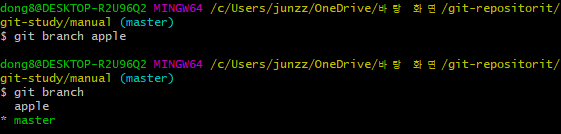

master branch 위에 apple 브랜치가 추가된 것을 확인할 수 있습니다.

master branch 앞에 * 표시는 아직 우리가 master branch 에서 작업하고 있다는 뜻입니다.


**브랜치가 추가된 후에는 커밋 로그 화면도 다르게 나타납니다.** `git log` 를 통해상태 확인을 해 보세용

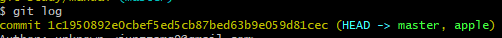

커밋 해쉬 옆 HEAD -> master, apple : apple이 추가 된모습

--> 이 표시는 저장소에 master, apple 2개의 브랜치가 있고, HEAD -> master 이므로 현재 작업중인 브랜치는 master 브랜치라는 의미입니다.


추가적인 branch 생성(생략) : 결과 사진만 첨부

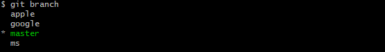


#### 브랜치 사이 이동하기  - git check out

> 각 브랜치를 오가면서 작업할 수 있기 위한 명령어

1. `git log` 로 상태 확인

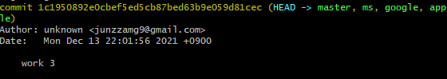

work 3 커밋 상태에 3개의 branch 가 생성된 모습을 확인할 수 있다.

```
이 모습은 master 브랜치 뿐만 아니라 ms,google,apple 브랜치에도 최신 커밋이 'wokr 3'라는 뜻입니다.
```


:heavy_check_mark: **현재상태 master branch 에 위치하는중**

2. 또 하나의 수정사항과 commit을 통해 어떻게 변화가 되어지는지 확인!

```bash
$ vim work.txt --> i --> 입력 --> esc --> :wq
$ git commit -am "master content4"
```

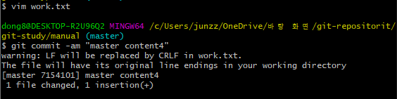

#### 커밋을 간단히 확인하기 위한 명령

> 한줄에 commit 상태를 확인할 때 좋음

```bash
$ git log --oneline
```

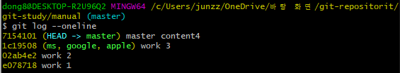

master의 경우  master content 4 브랜치에만 적용

이외의 work3 가 최신일 때 생성한 ms, google,apple은 work3 commit 상태에 남아있음


#### 현재 master 브랜치에서 다른 브랜치로 이동했을 때 변동사항 확인

```bash
$ git checkout apple
```

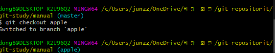

Wow!! 변동되었습니다!! 그럼 다시 commit 현황을 확인 해 볼까요??

`git log --oneline` 사용

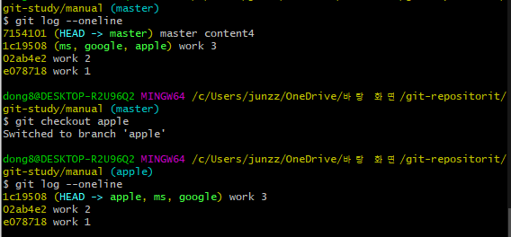

apple branch 최신 commit은 처음 분기될 때인 'work 3 ' commit 그대로 입니다. 그렇다면 work.txt 파일은 어떤 상태일까요?

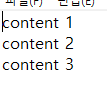

master work4  커밋에서는 content 4 까지 작성 되었던 text가 apple branch로 바뀌면서 work3 commit 상태의 파일로 변경된 모습

```
master 브랜치에서 분기 된 이후에 master 브랜치에 추가된 커밋은 apple 브랜치에 영향을 미치지 않았단 것을 알 수 있습니다.
```


## 03-3 브랜치 정보 확인하기

> 1. 브랜치에서 각각 커밋이 이루어질 때 커밋끼리 어떤 관계를 하고 있는지 확인하는 방법
> 2. 브랜치 사이의 차이점을 확인하는 방법
>
> 을 알아보겠습니다.


#### 새 브랜치에서 커밋하기

1. 현 apple branch 에서 새 commit을 남겨보겠습니다.

```bash
$ vim work.txt --> work.txt에 "apple content 4" 추가 입력 후 저장
```

2. apple 고객사만을 위한 txt 생성

```bash
$ vim apple.txt --> "apple content 4" 추가 입력 후 저장
```

3. 수정 된 2개 파일 add & commit (apple branch 에서 작업 한 상태)

상태 확인

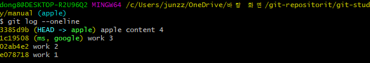

첫 번째 줄에 HEAD  -> apple 이라고 되어 있으므로  현재 apple 브랜치에 `체크아웃` 한 상태이고

apple 브랜치의 최신 커밋은 'apple content 4'이다.


#### :heavy_check_mark: git log 명령어 : 브랜치 commit 함께보기

```bash
$ git log  --oneline --branches
```

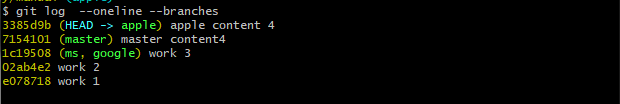

위의 결과 화면을 통해 어떤 브랜치에서 만든 커밋인지 알 수 있다.

master branch의 최신 커밋 : master content 4

ms, google branch의 최신 커밋 : work 3


#### :heavy_check_mark: 브랜치와 커밋의 관계를 좀더 보기쉽게 그래프 형태로 표시하는 명령어

```bash
$ git log --oneline --branches --graph
```

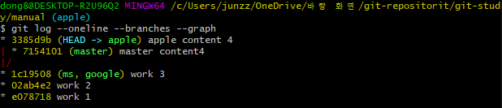

- apple 브랜치의 부모 **work 3 커밋** 
- master 브랜치의 부모 **work 3 커밋** 

두 브랜치 모두 work3에서 파생 되었다는 정보를 얻을 수 있다.


#### 브랜치 사이의 차이점 알아보기

> 브랜치 마다 커밋이 쌓여갈수록 브랜치 사이에 어떤 차이가 있는지 일일이 확인하기 어려워진다.
>
> 이럴때는 브랜치 이름 사이에 마침표 두개 `..` 를 넣는 명령으로 차이점을 쉽게 확인할 수 있습니다.
>
>
> 입력법
>
> 1. 브랜치 이릅과 마침표 사이는 공백없이 
> 2. 마침표 왼쪽에 있는 브랜치를 기준으로 오른쪽 브랜치와 비교.

```bash
$ git log master..apple
```

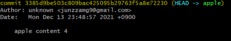

예시 결과

master 브랜치에는 없고  apple 브랜치에만 있는 커밋, 즉 "apple content 4" 커밋을 보여줍니다.


반대로 했을 때 결과는 "master content 4"가 결과에 나옵니다

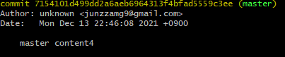


## 03-4 브랜치 병합하기 :red_circle:

> 브랜치 작업을 마무리하고 기존 브랜치와 합해야 합니다.
>
> 이것을 "브랜치 병합(merge)" 이라고 합니다.
>
> 각 여러가지 상황이 생릭 수 잇는데, 각 상황별 병합하는 방법을 알아보겠습니다.
>
> 병합하면서 브랜치 사이에 충돌이 있을 때 해결하는 방법도 함께 살펴봅니다.


### 1. 서로 다른 파일 병합하기


##### 사전준비(병합용 디렉터리 생성)

1. 디렉터리 생성

```bash
$ cd ~
$ git init manual-2
$ cd manual-2
$ ls -al
```

#### git init 디렉터리 이름

> 새로운 디렉터리를 만들고 저장소를 초기화 하는 과정을 한번에 처리가능

```bash
$ git init manual-2 --> 이거
```

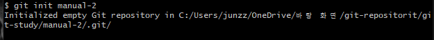

생성 된 모습

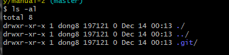

위 4개의 명령어 완료


2.  txt 파일 생성 및 내용추가

```bash
$ vim work.txt --> i --> 입력 --> esc --> :wq (작성저장 및 나가기)
$ git add work.txt
$ git commit -m "work 1"
```


###### 현재 상태

HEAD  -> master -> work 1 : 화살표 순으로 각각을 가리키고 있는 상태


3.  branch 생성

```bash
$ git branch o2
```


###### 현재 상태

HEAD  -> master -> work 1 

​										^

​									o2 가 work 1 커밋을 가리킴


4. master 브랜치에서 파일 추가

```bash
$ vim master.txt
$ git add master.txt
$ git commit -m "master work 2"
```


###### 현재 상태

​	첫 커밋      2번째 커밋 			master가 master work 2 커밋을 가리킴

 work 1  --> master work 2  <--  master <-- HEAD 

​	||

​	o2


5. o2 브랜치로 체크아웃

```bash
$ git checkout o2
```

6. o2 브랜치만의 파일 생성 후 커밋

```bash 
$ vim o2.txt
$ git add o2.txt
$ git commit -m "o2 work 2"
```


###### 현재 상태

​					master : master 브랜치는 master work2 커밋가리킴

​						||

work1  --> master work 2

​			ㄴ--> o2 work 2 

​							||

​							o2 : o2가 o2 work2 커밋을  가리킴

​							||

​							HEAD  : HEAD가 o2 브랜치를 가리킴

7. 현 상태 확인

```bash
$ git log --oneline --branches --graph
```

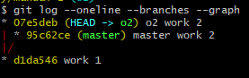


8. **o2 브랜치에서 작업이 다 끝났다고 가정하고, o2 브랜치 내용을 master브랜치로 병합합니다**.

```bash
$ git checkout master
```

브랜치 이동

##### 

9. 브랜치 병합을 위해 `git merge`명령 뒤에 가져올 브랜치 이름을 적습니다.

master 브랜치에 o2 브랜치를 가져와 병합하려면다음과 같이 입력

```bash
$ git merge o2
```

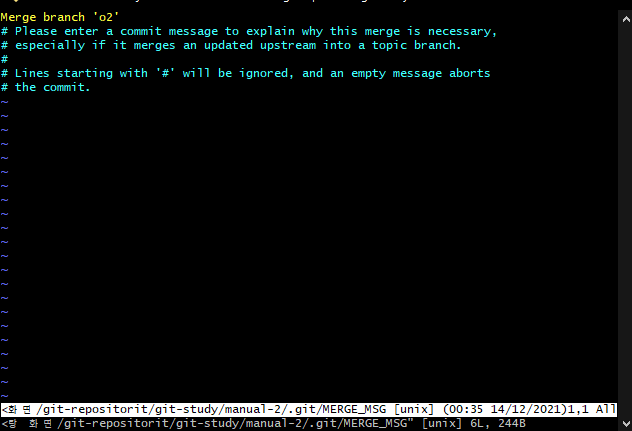

자동으로vim 이 실행되면서 "Merge branch 'o2'" 라는 메세지가 나타납니다.

커밋 메세지를 수정할 수 도 있고, 자동으로 메시지를 그대로 사용해도 됩니다.

여느 ex명령과 동일하게 수행합니다.


###### 현재 상태

​															HEAD : head가 master 브랜치를 가리킴

​																||	

​															master : master 브랜치는 Merge branch o2 커밋가리킴

​																||

work1  --> master work 2  --> Merge branch o2

​			ㄴ--> o2 work 2 --------------^ 

​							||

​							o2 : o2가 o2 work2 커밋을  가리킴

​						

10. ls -al 명령을 사용해 o2에 있던 파일이 mater 브랜치에 합쳐친 모습을 확인할 수 있다.

```bash
$ ls -al
```

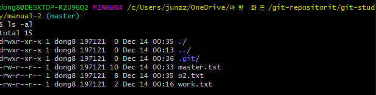

o2.txt는 o2 브랜치에만 있던 것인데 현재 병합 되었다!!


```bash
$ git log --oneline --branches --graph
```

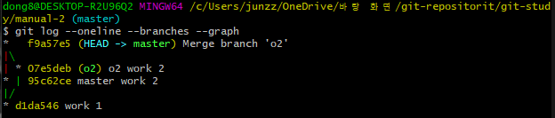


이처럼 두 브랜치에서 서로 다른 파일을 병합하는 경우 이렇게 깃에서 간단히 해결할 수 있습니다.


#### 추가내용! 빨리감기 병합

새로운 branch를 만들고 master에서 새로운 commit이 없을 때 병합하는 방법

분기한 브랜치에서 최신커밋을 master 브랜치가 가리키게만 하면 되기 때문이지요.

```bash
$ git merge o2
```

```
fast-forward 라는 메세지와 함께 병합됩니다.
이때는 포인터만 움직이는것이기 때문에 commmit 메세지가 나타나지 않습니다.
```


#### 추가내용! 브랜치 병합할 때 편집기 창이 열리지 않게 하기 -- 아까 메세지 수정창

커밋 메세지를 수정하지 않고, 그대로 사용한다면

```bash
$ git merge 브랜치명 --no-edit
```

브랜치를 병합할 때 편집기 창이 나타나지 않도록 설정한 경우, 커밋메세지를 추가하거나 수정하고 싶다면 병합 명령에  --edit 옵션을 사용합니다.

```bash
$ git mergr 브랜치명 --edit
```


### 2. 같은 문서의 다른 위치를 수정했을 때 병합하기

> master 브랜치와 o2 브랜치에 똑같이 work.txt 파일이 있습니다. 양쪽 브랜치에서 work.txt 문서를 수정하되 서로 다른 위치를 수정한 후 브랜치를 병합했을 때 어떤 결과가 나오는지 확인 해 보겠습니다.


**생성 과정에서 work.txt에 2줄의 공백을 두고 같은 내용을 작성하는 것 외에는 똑같이 진행합니다.

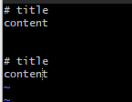

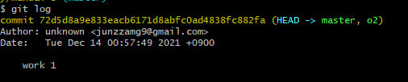

master와 o2 브랜치를 생성한 모습


1. 양쪽 브랜치 모드에 있는 work.txt를 먼저 master 브랜치에서 수정하겠습니다.

 ```bash
 $ vim work.txt --> (content -> master content 2 수정)
 $ git commit -am "master work 2"
 ```


2. o2 branch로 이동 및 내용 수정

```bash
$ git checkout o2
$ vim work.txt --> (content -> o2 content 2 수정)
$ git commit -am "o2 work 2"
```

3. 양측 커밋이 완료 되었습니다. master 브랜치로 이동

```bash 
$ git checkout master
```

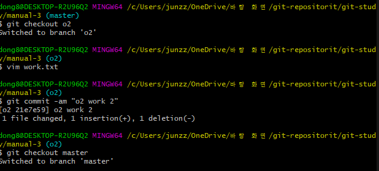

4. `git merge` 명령을 통해 o2 브랜치를 master 브랜치로 끌어옵니다.

```bash
$ git merge o2
```

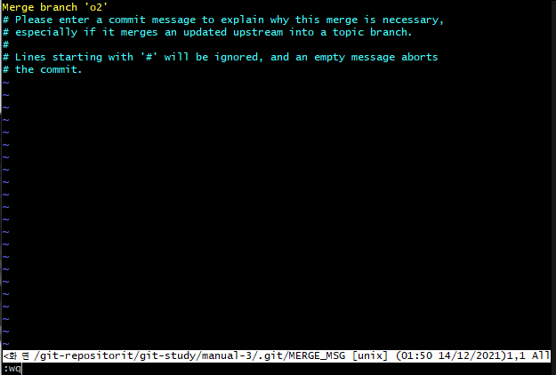

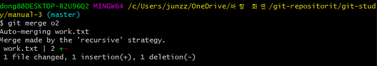

```
Auto-mergint work.txt
```

라는 병합 완료 메시지가 나타납니다.

5. cat 명령을 통한 내용 확인

```bash
$ cat work.txt
```

오우 합쳐졌네요우!!

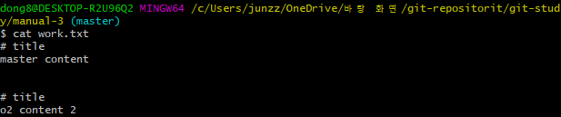


### 3. 같은 문서의 같은 위치를 수정했을 때 병합하기

> 깃에서는 '줄 단위'로 변경 여부를 확인합니다. 그래서 각 브랜치에 같은 파일 이름을 가지고 있으면서 같은 줄을 수정했을 때 브랜치를 병합하면 브랜치 충돌(conflict)이 발생합니다.
>
> master 브랜치와 o2 브랜치에서 같은 파일의 같은 위치를 수정한 후 병합해 보면서 어떤 경우에 브랜치 충돌이 생기는지, 그리고 어떻게 충돌을 해결하는지 알아보겠습니다.


...생성과정은 동일하게 진행합니다.

manual-4 , 각 브랜치별로 수정하고자 하는 텍스트 내용 work.txt 삽입

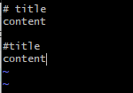


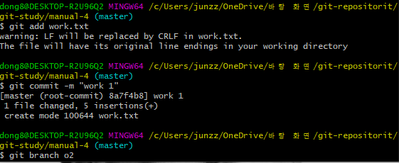

브랜치 생성


1. master branch에서 work.txt 수정 및 커밋

```bash
$ vim work.txt --> 중간 줄에 master content 2 삽입
```

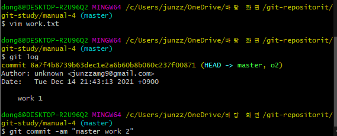

2. o2 브랜치의 work.txt 파일도 수정

```bash
$ git checkout o2
$ vim work.txt
```

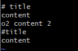

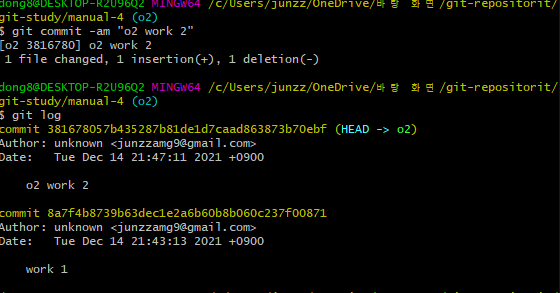

> master 브랜치와 o2 브랜치 양쪽에서 work.txt 파일을 수정했지만 문서 안의 수정위치가 같습니다. 이럴졍우 어떻게 병합 될까요? 아래 실습을 통해 확인 해 봅시다.

3. 우선 브랜치를 o2 에서 master로 이동합니다.

```bash
$ git checkout master
```

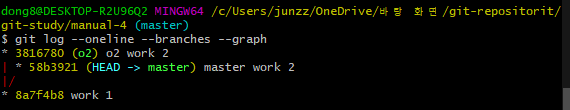

현재 상태!


4. git merge 명령어를 사용해 o2브랜치를 master 브랜치로 끌어옵니다.

```bash
$ git merge o2
```

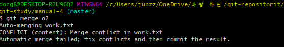

```
CONFLICT (content) : Merge conflict in work.txt
										ㄴ 파일 명
충돌이 일어났음을 알려준다.
```

이럴경우 충돌이 생긴 문서는 자동으로 병합될 수 없으므로 사용자가 직접 충돌 부분을 해결한 후 커밋해야 합니다. 충돌이 생긴 work.txt는 어떻게 되어있을까요? 빔에서 work.txt를 열어보겠습니다.


5. vim을 통해 work.txt 열기 ---> 그럼 다른 파일들이 충돌이 일어났을 때 vim을 통해서 일일이 수정해야하는가??? 뭐징??

```bash
$ vim work.txt
```

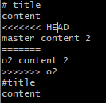

위 사진에서 각 줄 표시의 의미를 확인해봅시다.

<<<< HEAD 와 ======= 사이 내용 : 현재 브랜치, 즉 master 브랜치에서 수정한 내용. 

======= 와  >>>> o2 사이 내용 : o2 브랜치에서 수정한 내용입니다. 양쪽 브랜치의 내용을 참고하면서 직접 내용을 수정해야합니다.


6. 수정해봅시다

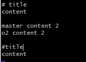

각 표시선들을 지우고 남길 내용으로 내용을 수정시켜줍니다.


7. 수정한 work.txt를 스테이지에 올리고 커밋하면 됩니다.

```bash
$ git commit -am "merge o2 branch"
```

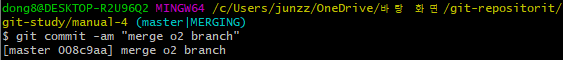

8. 지금까지의 관계 확인

```bash
$ git log --oneline --branches --graph
```

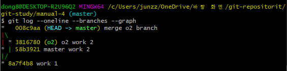

> o2 브랜치, master 브랜치가 분기 되었다가 master 브랜치로 o2가 merge 되었습니다.4

---

### :ballot_box_with_check: 병합 및 충돌 해결 프로그램

프로젝트의 규모가 클수록 브랜치가 많으므로 브랜치에서 병합해야 할 파일도 많아집니다. 그만큼 충동이 많이 생기겠지요. 그래서 깃의 브랜치 병합을 자동으로 처리해 주고 충돌을 해결해 주는 프로그램이 많습니다. 병합 알고리즘에는 2 way merge와 3 way merge가 훨씬 효율적이므로 3 way merge를 지원하는 프로그램을 선택하는것이 좋습니다. 다음은 자주 사용하는 병합 자동화 프로그램입니다.


| 프로그램 이름 | 설명                                                         |
| ------------- | ------------------------------------------------------------ |
| P4Merge       | 무료이고 직관적이며 사용이 편리하고 병합 기능이 뛰어납니다. 단축키가 지원되지 않는 단점이 있습니다. |
| Meld          | 무료이며 오픈소스입니다. 파일을 비교하는 것뿐만 아니라 직접 편집할 수 있습니다. |
| Kdiff3        | 무료이고 사용이 편리하고 병합 기능이 뛰어나지만 한글이 깨져 보일 수 있습니다. |
| Araxis Merge  | 유료지만 용량이 큰 파일에서도 잘 동작합니다.                 |

---

### 4. 병합이 끝난 브랜치 삭제하기

> 브랜치를 병합한 후 더 이상 사용하지 안는 브랜치는 깃에서 삭제할 수 있습니다. 단, 이렇게 브랜치를 삭제하더라도 이 브랜치가 완전히 지워지는것이 아니라 
>
> ✔ **다시 같은 이름의 브랜치를 만들면 예전 내용을 다시볼 수 있습니다.**


1. 앞서 3번 실습을 통해 따라 왔다면 master, o2라는 2개의 브런치가 존재

```bash
$ git branch
```

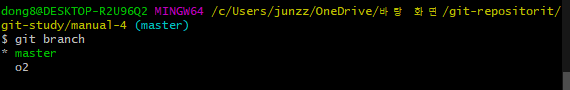

2개가 존재하는 모습


2. 저장소의 기본브랜치 => master 이기 때문에!! 브랜치의 삭제는 master브랜치에서 진행해야 합니다.

```bash
$ git checkout master
```


3. 브랜치 삭제 명령

```bash
$ git branch -d 브랜치명
```

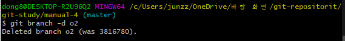

브랜치 삭제 완료!


앞서 :heavy_check_mark: 마크에서 다루었던, 같은 브랜치 명을 생성하면, 이전에 작업 했던 내용이 나타나는것을 알 수 있는데

이를 통해서 우리는 한가지를 알 수 있습니다.

➡ **브랜치를 삭제하는것은 완전히 저장소에서 없애는 것이 아니라 깃의 흐름 속에서 감추는 것이라고 생각하면 됩니다.**


## 03-5 브랜치 관리하기

> 깃과 브랜치를 관리하기 위한 몇가지 명령들


### 브랜치에서 checkout과 reset의 작동 원리

> 브랜치 가 있다면 우리는 ( checkout or reset) 을 더욱 다양하게 사용할 수 있습니다.


우선 HEAD와 브랜치의 개념부터 간단하게 정리한 후 시작하겠습니다.


1. 작업하는 폴더의 최상단 or 홈 디렉터리로 이동한 후(cd ~) test 디렉터리 생성 후 test 디렉터리로 이동합니다.

```bash
$ git cd ~
$ git init test
$ cd test
```


2. c1.txt 파일 생성 후 1을 입력하고 저장스테이지 올린 후 커밋

```bash
$ vim c1.txt
$ git add c1.txt
$ git commit -m "c1"
```


3. git log를 통해 상태 확인

##### HEAD : 기본적으로 현재 작업트리(워킹 디렉터리)가 어떤 버전을 기반으로 작업 중인지를 가리키는 포인터입니다.

##### 브랜치 : 브랜치에 담긴 커밋 중에서 가장 최근의 커밋을 가리킵니다.

 EX)

HEAD -> master를 기본적으로 바라보는 상태

c1 이라는 커밋을 생성한다면  master 브랜치 -> c1을 가리키는 상태

```bash
$ git log --oneline
```

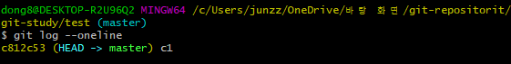

4. sub 라는 브랜치 생성 --> sub 브랜치 또한 c1 커밋을 가리킨다.

```bash
$ git branch sub
```


5. c2.txt 파일을 만들고 숫자 '2'를 입력 후 저장 및 커밋 (명령어들 위와 동일 )

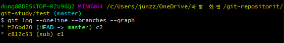

HEAD는 c1 -> c2 로 변경되었고 sub의 경우 sub 브랜치에서 새로운 커밋이 없기 때문에 c1 커밋을 바라본다.

master에서 commit 을 해 주었기 때문에, master는 최신인 c2 커밋을 바라본다.


6. sub 브랜치에 커밋 생성

```bash
$ git checkout sub
```

7.  sub 브랜치에 s1.txt 생성 & add & commit (코드 동일 생략)

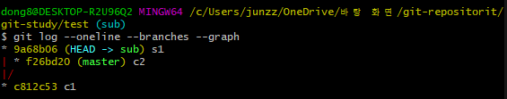

HEAD는 sub 브랜치를 , sub 브랜치는 s1 commit을 바라봅니다.

헤드는 가장 최근에 커밋된 곳을 따라간다! 라고 생각하면 되겠습니다.

HEAD가 바라보는 곳을 변경하고싶다면,

```bash
$ git checkout 바라볼 브랜치
```

명령을 통해 변경합니다.


#### 주요 내용 브랜치가 여러개일때의 reset 명령은 어떻게 사용 할 것인가?

> 2장엣선 reset 명령으로 master 브랜치에 있던 여러 커밋중 하나를 골라서 되돌아갔습니다.
>
>
> 브랜치가 여러 개일때는 현재 브랜치가 아닌 다른 브랜치에 있는 커밋을 골라서 최신 커밋으로 지정할 수 있습니다. ??? --> 머선말이고

8.   git log 명령을 사용해서 c2 커밋의 해시를 확인합니다.

```bash
$ git log --oneline --branches
```


커밋 해쉬들이 나열 되었습니다.


9. git reset 명령 다음에 c2 커밋 해시를 입력합니다. 

현재 위치는 sub 브랜치이고 여기의 브랜치가  c2커밋을 가리키도록 하는 행위를 현재 진행하고 있습니다.

```bash
$ git reset 현브랜치가 바라보고자하는 해쉬커밋
```


수행 완료창

상태확인

```bash
$ git log --oneline --branches --graph
```


결과!!

어? sub가 바라보던 s1 커밋이 사라졌네요?

why???

- HEAD가 가리키고 있는 ''브랜치''의 최신 커밋을 원하는 커밋으로 지정하여서 옮겼을 때, 브랜치와 연결이 끊긴 커밋은 삭제되기 때문입니다.


#### 파트정리

 git checkout 명령을 통해 HEAD를 제어해서 브랜치를 이동할 수 있다.

 git reset 명령을 통해 HEAD가 가리키고 있는 브랜치의 최신 커밋을 어디로든 변경할 수 있고, 이때 브랜치와 연결이 끊긴 커밋은 삭제된다.


### 수정중인 파일 감추기 및 되돌리기 --git stash

> 브랜치에서 파일을 수정하고 커밋하지 않은 상태에서 급하게 다른 파일을 커밋해야 할 경우가 있습니다.
>
> 아직 커밋하지 않은 파일들을 그냥 두어도 상관없지만 계속 커밋하라는 메시지가 나타나기때문에 번거롭습니다. 
>
> 실수로 다른 파일이 커밋될 수 있구요, 이렁 때 아직 커밋하지 않고 작업중인 파일들을 잠시 감춰둘 수 있습니다.
>
> 그리고 당장 필요한 작업들을 끝낸 후 다시 감춰둔 파일을 꺼내오면 됩니다.


사전작업

```bash
$ cd ~
$ git init st
$ cd st
```


1. git stash 명령을 위한 전제조건 : tracked

> 즉, 한번은 커밋한 상태여야 합니다.

```bash
$ vim f1.txt
$ git add f1.txt
$ git commit -m "f1"
```


f2 파일도 만들고 동일작업 수행 해줍니다.


2. 두 파일 아무렇게나 수정 후 저장 & git status로 상태 확인

```bash
$ git status
```


스테이징 되어지지 않았다! 즉 add를 해주어야 한다.


> 이제 가정 해 봅시다.
> f1,f2 파일을 커밋하기 전에 다른 파일을 수정해야한다고 가정해봅시다. 커밋하지 않은 수정 내용을 어딘가에 보관하려면
> `git stash`명령을 사용합니다. `git stash save` or `git stash`
>
> 를 이용하여숨겨줍니다.

```bash
$ git stash
```


stash 이후의 상태 변화!

WOW 감춰졌네요


숨겨진 목록들을 확인할 수 있습니다.

스택(stack) 형식을 따릅니다

- 최근에 감춘것을 최근으로 쌓기 때문에

```bash
$ git stash list
```


3. 급하게 커밋할것들을 올렸다면, 다시 꺼내줍니다.

```bash
$ git stash pop
```

stash는 한번 입력할 때 있던 파일들이 한번에 입력되어있습니다.

위에서는 f1,f2가 한번에 stash 되었기 때문에 pop을 하면 f1,f2 파일이 다시 나타납니다.


---

#### stash apply와 stash drop

##### - stash apply

stash 목록에 저장된 수정내용을 나중에 또 사용할지도 모른다면 git stash apply 명령을 사용합니다.

stash 목록에서 가장 최근 항목을 되돌리지만 저장했던 내용을 그대로 남겨둡니다.


그대로 남겨져 있는 모습


##### - stash drop

stash 목록에서 가장 최근 항목을 삭제합니다.

---

3장 end

