# 03. 깃과 브랜치

고객사에게 다른 버전의 사용 설명서를 제공해야 할 때 발생하는 문제를 브랜치를 통해 해결할 수 있습니다.


## 03-1 브랜치란?

> 모든 버전 관리 시스템에는 '브랜치(branch)' 라는 개념이 있습니다. 브랜치는 원래 나뭇가지라는 뜻이지요.


### 브랜치 기능 살펴보기

깃으로 버전 관리를 시작하면 기본적으로 master 라는 브랜치가 만들어집니다.

사용자가 커밋할 때마다 master 브랜치는 최신 커밋을 가리킵니다.

즉, 브랜치는 커밋을 가리키는 포인터와 비슷하다고 생각하면 됩니다.


### 분기

여기서 분기점을 만들어 기존 master 브랜치를 유지하면서 기존 파일 내용을 수정하거나 새로운 기능을 구현할 파일을 만들 수 있습니다.


### 병합

새 브랜치에서 원하는 작업을 다 끝냈다면 새 브랜치에 있던 파일을 원래 master 브랜치에 합치는 행위


## 03-2 브랜치 만들기

---

### 실습상황 설정하기

1. 터미널 창을 열어 폴더에 새 디렉터리 생성 및 이동

```bash
$ mkdir manual
$ cd manual
```

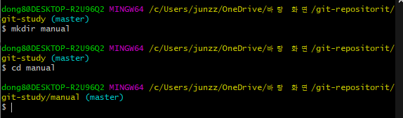

2. `ls -al` 명령어를 사용하여 .git 디렉터리가 만들어졌는지 확인.

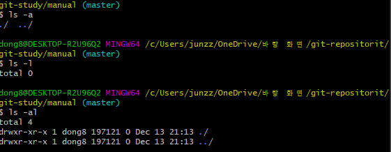

생성된 모습을 확인할 수 있다.


3. manual 디렉터리 안에 work.txt 파일 만들기


텍스트파일 자체 생성

명령어로 생성

```bash
$ vim work.txt
```

`i` 키 입력을 통해 입력 후 `esc` 를 통해 ex 입력창 들어가기

`:wq` 를 통해 저장 후 종료

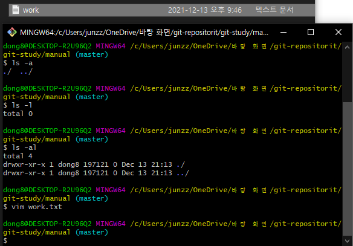

생성 된 모습을 확인할 수 있다.


4. 방금만든 work.txt 스테이지에 올리고 커밋합니다.

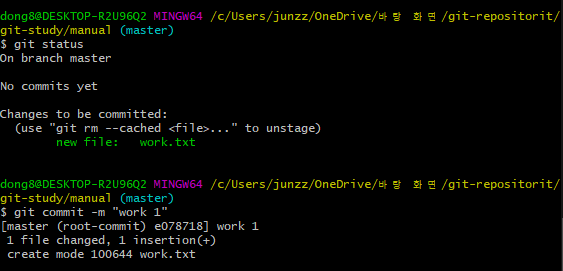

Change to be committed 라는 메세지를 통해 스테이징 된 상태 확인

그리고 commit 을 통해

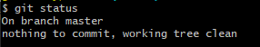

unmodified 상태임을 확인

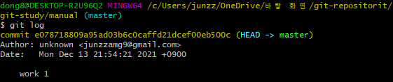

###### commit ~~~ : 커밋 해쉬

###### Author : 작성자

###### Date : 작성 날짜

###### work 1 : 커밋 명

이후 2회 더 커밋을 남긴다.(생략)

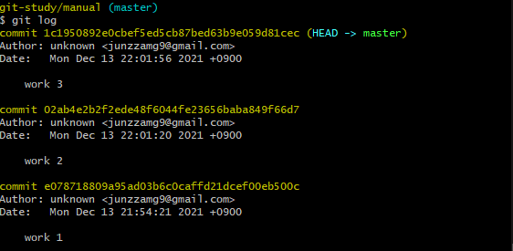

총 3회의 커밋을 완료하였다.

---


### 새 브랜치 만들기

> 이제부터 직접 브랜치를 만들면서 예시 상황을 해결 해 보자.
>
> 현재 상황 : apple, google, ms 라는 고개사가 있다고 가정해 보겠습니다.


#### 브랜치 확인명령

```bash
$ git branch
```

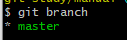

master 는 저장소를 만들 때 기본적으로 master 브랜치가 만들어 집니다. 그동안 일반적으로 branch 생성이 없었다면 master 브랜치에서 사용하게 되어 있습니다.


#### 브랜치 생성

```bash
$ git branch 생성할branch이름
```

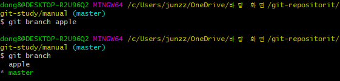

master branch 위에 apple 브랜치가 추가된 것을 확인할 수 있습니다.

master branch 앞에 * 표시는 아직 우리가 master branch 에서 작업하고 있다는 뜻입니다.


**브랜치가 추가된 후에는 커밋 로그 화면도 다르게 나타납니다.** `git log` 를 통해상태 확인을 해 보세용

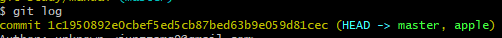

커밋 해쉬 옆 HEAD -> master, apple : apple이 추가 된모습

--> 이 표시는 저장소에 master, apple 2개의 브랜치가 있고, HEAD -> master 이므로 현재 작업중인 브랜치는 master 브랜치라는 의미입니다.


추가적인 branch 생성(생략) : 결과 사진만 첨부

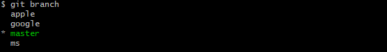


#### 브랜치 사이 이동하기  - git check out

> 각 브랜치를 오가면서 작업할 수 있기 위한 명령어

1. `git log` 로 상태 확인

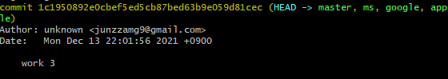

work 3 커밋 상태에 3개의 branch 가 생성된 모습을 확인할 수 있다.

```
이 모습은 master 브랜치 뿐만 아니라 ms,google,apple 브랜치에도 최신 커밋이 'wokr 3'라는 뜻입니다.
```


:heavy_check_mark: **현재상태 master branch 에 위치하는중**

2. 또 하나의 수정사항과 commit을 통해 어떻게 변화가 되어지는지 확인!

```bash
$ vim work.txt --> i --> 입력 --> esc --> :wq
$ git commit -am "master content4"
```

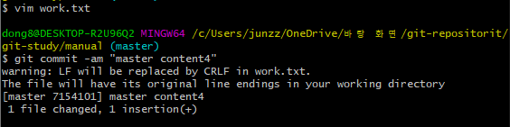

#### 커밋을 간단히 확인하기 위한 명령

> 한줄에 commit 상태를 확인할 때 좋음

```bash
$ git log --oneline
```

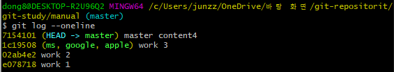

master의 경우  master content 4 브랜치에만 적용

이외의 work3 가 최신일 때 생성한 ms, google,apple은 work3 commit 상태에 남아있음


#### 현재 master 브랜치에서 다른 브랜치로 이동했을 때 변동사항 확인

```bash
$ git checkout apple
```

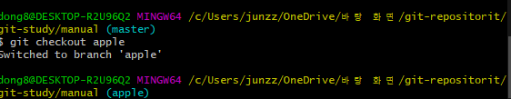

Wow!! 변동되었습니다!! 그럼 다시 commit 현황을 확인 해 볼까요??

`git log --oneline` 사용

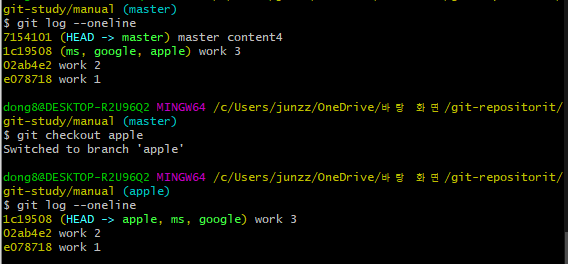

apple branch 최신 commit은 처음 분기될 때인 'work 3 ' commit 그대로 입니다. 그렇다면 work.txt 파일은 어떤 상태일까요?

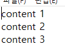

master work4  커밋에서는 content 4 까지 작성 되었던 text가 apple branch로 바뀌면서 work3 commit 상태의 파일로 변경된 모습

```
master 브랜치에서 분기 된 이후에 master 브랜치에 추가된 커밋은 apple 브랜치에 영향을 미치지 않았단 것을 알 수 있습니다.
```


### 03-3 브랜치 정보 확인하기

> 1. 브랜치에서 각각 커밋이 이루어질 때 커밋끼리 어떤 관계를 하고 있는지 확인하는 방법
> 2. 브랜치 사이의 차이점을 확인하는 방법
>
> 을 알아보겠습니다.


### 새 브랜치에서 커밋하기

